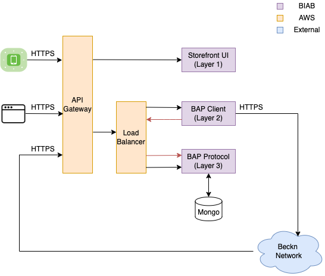

# 
 Beckn in a Box BAP 

This repository contains the instructions and files required to deploy this
Beckn Application (BAP) or any of its building blocks individually.

> **Disclaimer:** This project is still in beta phase. Unstable for Production Use

## Overview

This BAP comprises of four building blocks: the UI layer, the Beckn protocol
client, the Beckn protocol helper and the protocol DTOs.

### UI Layer

The UI layer is a Progressive Web Application implemented in
[`vue`](https://github.com/vuejs/vue) using the
[`storefront`](https://github.com/vuestorefront/vue-storefront) framework. The
UI layer interacts with the beckn protocol client to perform operations using
the Beckn protocol.

### Beckn Protocol Client

The beckn protocol client receives inputs from the UI layer and makes calls
using the Beckn protocol to the Beckn network. The beckn protocol client
interacts with the protocol layer to get responses (provided via callbacks) from
the Beckn network. It is written in [`kotlin`](https://kotlinlang.org/).

### Protocol Helper

The protocol helper receives callback responses from the Beckn network and saves
them to a [`mongo`](https://github.com/mongodb/mongo) database. The beckn
protocol client then queries this layer to retrieve the responses. It is written
in [`kotlin`](https://kotlinlang.org/).

### Protocol DTOs

The [`protocol-dtos`](https://github.com/beckn/protocol-dtos) repository
contains schema definitions that are used in all 3 building blocks. It is
written in [`kotlin`](https://kotlinlang.org/).

## Usage

All four building blocks are designed such that they can be used individually or
together. Each building block has a docker file that builds the component as a
docker image. View the [docker usage guide](docs/guides/usage/docker.md) for
more details.

## Issues/Contributing

For any questions, please don't hesitate to
[open a new discussion](https://github.com/beckn/bap-reference-app/discussions/new).
If you wish to contribute, please feel free to discuss, pick up any issue and
implement the bug fix/feature request!

### Product and Versioning Info

| Projects/Products    | Version | Versioning Scheme                                                                                                                 | Manager | Responsible | Accountable | Consulted        | Informed       | Last update                                  | Last updated date | Next upcoming release date |
| -------------------- | ------- | --------------------------------------------------------------------------------------------------------------------------------- | ------- | ----------- | ----------- | ---------------- | -------------- | -------------------------------------------- | ----------------- | -------------------------- |
| Retail Reference BAP | 0.1.1   | [Version Management](https://docs.google.com/document/d/1HjXV4W2STirMUa2_L8bGWB0ORn9SeYRvJSyUPbntbXY/edit#heading=h.b06d3jp4draa) | Nirmal  | Nirmal      | Nirmal      | Enterprise Minds | General Public | End-to-end functionality testing in progress | 14 Feb 2022       | 28 Feb 2022                |

## Releases

| Release | Start Date  | End Date    | Status      | Delay in Days | REQ                                                                                  | Documentation                                        | Code                                                   | Logs                                                            |
| ------- | ----------- | ----------- | ----------- | ------------- | ------------------------------------------------------------------------------------ | ---------------------------------------------------- | ------------------------------------------------------ | --------------------------------------------------------------- |
| 0.1.1   | 07 Feb 2022 | 18 Feb 2022 | Delayed | 10 | [Task List](https://github.com/beckn/bap-reference-app/issues?q=milestone%3Av0.1.1+) | [Wiki](https://github.com/beckn/beckn-in-a-box/wiki) | [Codebase](https://github.com/beckn/bap-reference-app) | [Logs](https://github.com/beckn/bap-reference-app/commits/main) |

> Note that this version number is for the Retail Beckn Application. The Docker
> images are released using the versioning system mentioned
> [here](docs/guides/usage/docker.md#using-the-individual-components). This
> might change in the future to keep it consistent with the Retail App's
> versioning system.
